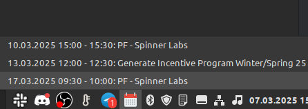

# Calendar events

## What does this do?

It reads your primary calendar from google calendar and notifies you about it with sounds.
It gives you a sound warning 5 minutes before, 4 minutes and 1-30 seconds before the event/meeting.



## How to use it?

1. Clone the repository

2. Install the requirements
```bash

yarn

```


Make the service file. 

```bash

sudo nano /etc/systemd/user/calendar-events.service

```

someting. like this

```bash

[Unit]
Description=work-calendar-events
BindsTo=graphical-session.target
After=network.target

[Service]
Type=simple
Restart=always
RestartSec=10
SyslogIdentifier=work-calendar
WorkingDirectory=%h/PhpstormProjects/node-calendar-events
ExecStart=/usr/local/bin/node src/bin/service.js
#StandardOutput=null

[Install]
WantedBy=default.target

```

```bash